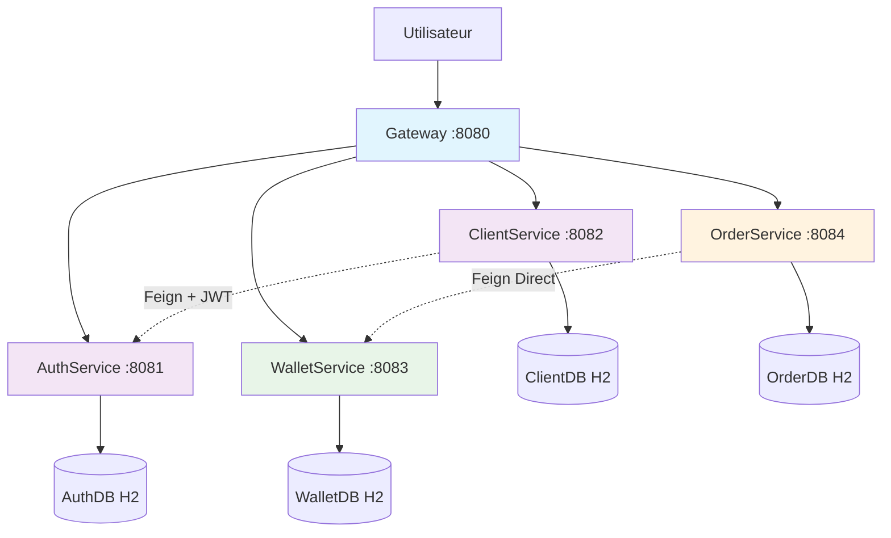

# BrokerX – Documentation d'Architecture (Phase 2 - Microservices)
Ce document, basé sur le modèle **arc42**, décrit l'architecture microservices du système de courtage BrokerX.

---

## 1. Introduction et Objectifs

### Panorama des exigences

---

## 1. Introduction et Objectifs

### Panorama des exigences
L’application « BrokerX » est un prototype Java monolithique de courtage sécurisé permettant à ses clients de:
- Passer des ordres 
- Consulter leurs portefeuilles 
- Recevoir exécutions et confirmations
- Effectuer le règlement et la compensation des transactions 

Elle comprend :  
- L’utilisation de conteneurs avec Docker  
- L’écriture et l’exécution de tests automatisés avec JUnit + Maven  
- La combinaison d’outils modernes de développement (VS Code, Github/Gitlab, Docker)  

L’objectif de la première phase est de fournir un prototype monolithique fonctionnel, conteneurisé avec Docker, incluant des tests automatisés et un pipeline CI/CD de base.  
Les phases futures évolueront vers des microservices puis une architecture orientée événements.

### Objectifs qualité
| Priorité | Objectif qualité | Scénario |
|----------|------------------|----------|
| 1 | **Performance** | Latence de placement d’ordre ≤ 500 ms, débit ≥ 300 ordres/sec. Priorité absolue car la rapidité de placement d’ordre est critique pour un système de courtage. Même en mode prototype, la perception de rapidité est un facteur clé de réalisme. |
| 2 | **Sécurité** | Deuxième priorité car l’application gère des données sensibles (identité, transactions financières). MFA obligatoire limite le risque de fraude. |
| 3 | **Disponibilité** | Le prototype n’est pas en production mais doit rester disponible pour les démonstrations et les tests. Un objectif de 90% est réaliste dans un contexte académique. |
| 4 | **Déployabilité** | Mise en place d’un pipeline CI/CD simple mais automatisé (tests unitaires + build Docker + déploiement) pour assurer fluidité des itérations. |

Explication de la priorisation: 

La priorisation des objectifs qualité reflète les besoins essentiels d’une application de courtage. La performance est placée en premier car la rapidité de traitement des ordres est critique pour la crédibilité du système, même en contexte académique. La sécurité arrive ensuite puisqu’il s’agit de protéger des données sensibles et d’instaurer la confiance grâce au MFA. La disponibilité est moins critique qu’en production mais nécessaire pour garantir des démonstrations et tests fiables (90% suffisent). Enfin, la déployabilité est priorisée en dernier : le pipeline CI/CD est un support à l’évolution et aux itérations rapides, mais il ne prime pas sur les exigences métier immédiates.

### Parties prenantes
- **Clients** : Investisseurs utilisant la plateforme 
-**Opérations Back-Office** : gestion des règlements, supervision. 
-**Conformité / Risque** : surveillance pré- et post-trade. 
-**Fournisseurs de données de marché** : cotations en temps réel. 
-**Bourses externes** : simulateurs de marché pour routage d’ordres.  
- **Développeurs** : Apprentissage des outils modernes de développement et des pipelines CI/CD  

---

## 2. Contraintes d’architecture
| Contrainte | Description |
|------------|-------------|
| **Technologie** | Java 21 avec Spring Boot, PostgreSQL, JUnit et GitLab CI/CD |
| **Déploiement** | Application et base de données conteneurisées avec Docker et orchestrées avec docker-compose |
| **Éducatif** | Le projet doit démontrer clairement les concepts d’infrastructure et de CI/CD |

---

## 3. Portée et contexte du système

### Architecture Microservices

Must haves (4 UC):

## UC-01 — Inscription & Vérification d’identité
Le processus par lequel un nouvel utilisateur crée un compte sur la plateforme BrokerX. Le client saisit son adresse courriel ou son numéro de téléphone, définit un mot de passe et fournit ses informations personnelles (nom, adresse, date de naissance). Le système valide le format des données et crée un compte avec le statut Pending. Un lien de vérification est envoyé par courriel ou par SMS.

Lorsque l’utilisateur confirme son identité via le lien et les mécanismes de sécurité (OTP ou MFA), le système active le compte, enregistre l’événement dans les journaux d’audit (avec horodatage et empreinte des documents) et le statut devient Active.

- Acteur : Personne x
- Préconditions: Aucun compte actif pour cet email.
- Déclencheur: L’utilisateur ouvre la page /register.
- Entrées: email, mot de passe.
Traitement:
  1) Le système crée un Client avec statut PENDING.
  2) Génère un OTP et l’envoie par email (simulateur).
  3) L’utilisateur saisit l’OTP sur la page dédiée.
  4) Si OTP valide et non expiré → statut passe à ACTIVE.
- Règles: email format valide; mot de passe non vide; OTP à durée courte; 3 essais max.
- Sorties: Compte ACTIVE; session non créée automatiquement (login requis).
- Erreurs: OTP invalide/expiré → rester PENDING.

## UC-02 — Authentification & MFA
Le client saisit son identifiant et son mot de passe. Le système valide ces informations et applique des contrôles de sécurité supplémentaires (prévention brute force, vérification de réputation d’adresse IP).

Multi-authentification (MFA) est activée et obligatoire, le système demande un second facteur d’authentification tel qu’un code OTP envoyé par courriel. L’utilisateur saisit ce code et, en cas de succès, le système génère un jeton de session (JWT ou opaque), attribue le rôle Client et donne accès à son dashboard. 

- Acteur: Client
- Préconditions: Compte ACTIVE.
- Déclencheur: L’utilisateur ouvre /login.
- Entrées: email, mot de passe, puis OTP.
- Traitement:
  1) Vérification email/mot de passe.
  2) Envoi d’un OTP par email (MFA).
  3) Saisie OTP; si OK → création de session Spring Security.
- Règles: 3 essais OTP; OTP expirant; pages sensibles protégées.
- Sorties: Session active; accès au tableau de bord et aux actions (dépôt, ordre).
- Erreurs: MDP/OTP incorrects → refus d’accès.

- **UC-03 — Approvisionnement du portefeuille (dépôt virtuel)**
L’utilisateur saisit le montant souhaité en monnaie simulée. Le système applique des contrôles de validité (plafonds minimum et maximum, règles anti-fraude), puis crée une transaction avec l’état Pending.

Le service de paiement simulé renvoie ensuite un statut Settled et le système crédite le portefeuille de l’utilisateur du montant demandé et notifie l’utilisateur.

Si le paiement est asynchrone, le solde n’est crédité qu’à la confirmation. En cas de rejet par le service de paiement, la transaction est marquée Failed avec une notification. Pour les requêtes répétées, le système gère l’idempotence en retournant le même résultat qu’au premier traitement.

- Acteur: Client connecté
- Préconditions: Portefeuille existe pour le client.
- Déclencheur: Formulaire /deposit (montant).
- Entrées: amount (double > 0).
- Traitement (Transactional):
  1) Valide montant > 0 et sous plafond (ex. ≤ 10 000).
  2) Charge le Portefeuille par clientId.
  3) Incrémente le solde et persiste.
  4) Crée une Transaction(type = DEPOSIT, montant, portefeuilleId) pour l’audit.
- Sorties: Réponse texte “SUCCESS: …”; le front affiche une alerte et redirige vers /dashboard.
- Erreurs: “ERROR: …” (montant invalide, portefeuille absent, exception persistance).

- **UC-05 — Placement d’un ordre (marché/limite) avec contrôles pré-trade**
L’utilisateur saisit les informations de l’ordre : symbole de l’instrument, type (achat ou vente), type d’ordre (marché ou limite), quantité, prix (si limite) et durée (DAY, IOC, etc.).

Le système normalise et horodate la demande avec précision (UTC, millisecondes ou nanosecondes). Avant d’accepter l’ordre, il applique une série de contrôles pré-trade : disponibilité des fonds ou de la marge, respect des bandes de prix et des tailles de tick, interdictions réglementaires, limites de taille par utilisateur et cohérence des données.

Si les contrôles sont réussis, le système attribue un identifiant unique d’ordre (OrderID), enregistre l’opération et l’envoie au moteur interne d’appariement. Sinon, l’ordre est rejeté avec un message d'erreur clair.

- Acteur: Client connecté
- Préconditions: Portefeuille existant; solde suffisant pour BUY; positions suffisantes pour SELL.
- Déclencheur: Page /placeOrder (flux en 2 étapes: aperçu → confirmer).
- Entrées: type (BUY/SELL), symbole (liste fixe: SPY, QQQ, VOO, …), quantité (>0).
- Traitement (Transactional):
  1) Calcule le prix (table côté UI) et le total.
  2) BUY: vérifie solde ≥ total → débite solde.
     SELL: agrège les ordres exécutés (status=1) → vérifie quantité détenue → crédite solde.
  3) Persiste l’Order (clientId, symbole, qty, prix, status=1).
  4) Crée une Transaction(type = ORDER, montant total, portefeuilleId, orderId).
- Sorties: “SUCCESS: Achat/Vente …”; redirection vers /dashboard.  
  - Balance: GET /api/portefeuille/balance (nombre).
  - Holdings: GET /api/orders/holdings (map symbole → quantité) mis à jour.
- Erreurs: “ERROR: Fonds insuffisants”, “ERROR: Quantité indisponible”, “ERROR: Entrée invalide”.

### Contexte borné

Client & Account Management:
Gère l’inscription, l’authentification et le statut des clients (PENDING, ACTIVE).
Responsable de la sécurité (MFA).

Portfolio & Transactions:
Gère les dépôts, retraits, solde du portefeuille.
Historise toutes les transactions (audit trail).

Order Management: 
Gère le placement, la validation pré-trade et l’exécution des ordres.

### Language omniprésent

Dans BrokerX, les concepts métier et leur vocabulaire sont partagés entre développeurs, utilisateurs et enseignants afin d’assurer une compréhension commune. Ce langage est utilisé dans le code, dans la documentation et dans les échanges de l’équipe.

Client : utilisateur inscrit de la plateforme, identifié par email et mot de passe.

Compte : ensemble des informations personnelles et du statut (PENDING, ACTIVE, REJECTED).

Portefeuille : solde et positions détenus par un client.

Transaction : enregistrement immuable d’une opération financière (dépôt, retrait, achat, vente).

Ordre : instruction d’achat ou de vente d’un instrument financier, pouvant être de type marché ou limite.

MFA/OTP : second facteur d’authentification pour sécuriser la connexion.

Service : logique métier regroupée, qui ne dépend pas de la persistance ou de l’interface utilisateur.

Repository : interface d’accès aux entités persistées (ex. ClientRepository, OrderRepository).

### Esquisse du MDD

Entités : Client, Portefeuille, Ordre, Transaction.

Agrégats :
Client → possède Portefeuille.
Portefeuille → contient Transaction.
Ordre  → appartient à un Client.

Relations :
Client 1─1 Portefeuille
Portefeuille 1─* Transaction
Client 1─* Ordre

### Contexte technique
- **Application** : Monolithe Java 21 avec Spring Boot.
- **Interface utilisateur** :HTML/CSS/JS pour l’interface utilisateur et Thymeleaf pour le rendu côté serveur des pages HTML dynamiques (dans /templates).
- **Tests** : JUnit 5, Spring Boot Test pour les tests automatisés.
- **Conteneurisation** :Docker (application + base de données).
- **CI/CD** : Pipeline GitLab pour tests et déploiement automatique
-**Base de données** : H2 et PostgreSQL comme bases de données.
- **Persistance** : Spring Data JPA (Java Persistence API) pour le mapping objet-relationnel et la gestion des entités, avec H2/Hibernate comme implémentation sous-jacente.

---

## 4. Stratégie de solution
| Problème | Approche de solution |
|----------|---------------------|
| **Infrastructure** | Adoption d’une architecture hexagonale DDD : la logique métier(entités, règles métiers) est séparé des interactions externes qui passent par des ports/adapteurs(REST, persistence, envoi des email) |
| **Dépendance à une base de données** | Définition d’interfaces  pour les opérations de persistance des repositoires Spring Data JPA. Pas de couplage entre logique métier et repositoires. |
| **Évolution ou changement de technologie de persistance** | Remplacement ou ajout d’un nouvel adaptateur (H2->PostgreSQL) sans modifier la logique métier ni les ports |
| **Gestion des transactions** | Utilisation de Spring Data JPA pour gérer les transactions Spring garantissant... |
| **Démarrage rapide et tests locaux** | Utilisation de H2 en mémoire pour le développement et les tests, permet protype rapide qui ne nécéssite aucune configuration complexe ni dépendance à une base externe |
| **Exposition sécurisée des services** | Contrôleurs REST (adapters entrants) qui valident et transmettent les requêtes au domaine via les ports, en respectant les règles de sécurité et de validation |
| **Envoi des emails de verification/notifications** | Intégration de Spring Mail (JavaMailSender) comme adaptateur sortant pour l’émission d’e-mails de vérification de compte et de notifications transactionnelles. |

---

## 5. Vue des blocs de construction - Architecture Microservices

### Décomposition par domaines métier

**AuthService** :
- Entités : UserCredential
- Responsabilités : Authentification, génération JWT, validation OTP
- Base de données : authdb.mv.db (H2)

**ClientService** :
- Entités : Client
- Responsabilités : Gestion profils clients, inscription complète
- Communication : Appelle AuthService via Feign pour créer credentials
- Base de données : clientdb.mv.db (H2)

**WalletService** :
- Entités : Wallet
- Responsabilités : Gestion portefeuilles, opérations financières
- Base de données : walletdb.mv.db (H2)

**OrderService** : 
- Entités : Order, Transaction
- Responsabilités : Placement ordres, validation pré-trade
- Communication : Appelle WalletService via Feign pour débits/crédits
- Base de données : orderdb.mv.db (H2)

**Gateway** :
- Responsabilités : Routage, sécurité JWT, propagation headers
- Pas de persistance, stateless

### Relations cross-services :
- ClientService → AuthService (Feign) : Création credentials
- OrderService → WalletService (Feign) : Opérations financières  
- Gateway ↔ Tous services : Routage et sécurité

Rationnel : Isolation des domaines métier avec communication explicite via API REST.

---

## 6. Vue d’exécution

---

## 7. Vue de déploiement

Le système BrokerX est déployé dans un environnement conteneurisé avec Docker.
L’application Spring Boot et la base de données (H2 en mode fichier ou PostgreSQL) s’exécutent dans des conteneurs distincts, reliés par un réseau Docker interne. Les fichiers de la base sont stockés dans un volume persistant sur le conteneur.

Du côté CI/CD, le code source est hébergé sur GitHub/GitLab, où un pipeline exécute les tests Maven/JUnit, construit une image Docker et peut la publier dans un registre. Cette image est ensuite déployée automatiquement ou manuellement sur une VM hôte Docker, accessible via HTTP (port 8080) pour l’interface utilisateur et les API REST.

La communication externe se fait via le navigateur de l’utilisateur → brokerx-app (UI Thymeleaf et API REST), tandis que la persistance passe par JDBC vers la base de données interne. Les logs sont collectés sur la VM via stdout/stderr.

## MUST HAVES: 

UC01: C’est le point d’entrée de tout utilisateur. Sans inscription, aucun autre CU n’est possible.

Permet de créer un compte, vérifier l’identité et activer l’accès qui est primordial dans une application de courtage dans lequel les usagers doivent avoir un certain niveau de confiance e tsécurité. 

UC02: Garantit que seuls les utilisateurs autorisés accèdent à la plateforme. Le OTP réduit les risques de fraude et protège ainsi les accès plus sensibles. 

UC03: Condition nécessaire pour réaliser des opérations de trading qui est le but de l'apllic. 

UC05:C’est le cœur de la plateforme BrokerX : permettre le trading.

Un utilisateur actif s’attend à pouvoir placer des ordres dès son inscription et son dépôt effectués.

---

## 8. Concepts transversaux

Architecture hexagonale (Ports & Adapters) : séparation stricte entre logique métier (domaine) et interfaces techniques (REST controllers, persistance, emails).

Domain-Driven Design (DDD) : usage du langage omniprésent, entités (Client, Portefeuille, Ordre, Transaction), agrégats et événements de domaine pour garder la cohérence métier.

Persistance relationnelle avec Spring Data JPA : abstraction de la base via des Repository (ClientRepository, OrderRepository...), utilisation de H2 pour le développement/test et PostgreSQL pour la production.

Sécurité et MFA (Multi-Factor Authentication) : authentification avec mot de passe + OTP envoyé par email, géré par Spring Security.

CI/CD automatisé : pipeline GitLab qui exécute les tests (JUnit), construit l’image Docker et déploie l’application.

Conteneurisation : application et base packagées dans des conteneurs Docker, orchestrées avec docker-compose pour reproductibilité rapide (<30 min).

---

## 9. Décisions d’architecture
*(Lister les ADR – Architectural Decision Records – pour ce projet. Inclure des références aux fichiers ADR si disponibles.)*  

1) ADR01: Adoption de architechture hexagonale pour découpler la logique métier des services et base de données. veuillez consulter `/docs/adr/adr001.md`

2) ADR02: Le système BrokerX utilise Spring Data JPA pour gérer la persistance des données via des entités et des dépôts (JpaRepository).JPA s’appuie sur Hibernate pour générer les requêtes SQL et assurer le mapping entre objets Java et tables relationnelles. veuillez consulter `/docs/adr/adr002.md`

3) ADR03: ..
---

## 10. Exigences qualité - Architecture Microservices

### Scénarios de qualité

**Sécurité Distribuée** : 
Lorsque un utilisateur tente d'accéder à un service protégé.
Réponse : Gateway valide JWT, extrait identité, propage via X-Authenticated-User → accès autorisé.
Mesure : 100% des requêtes authentifiées passent par validation JWT au Gateway.

**Performance Inter-Services** :
300 ordres soumis simultanément avec appels WalletService.
Réponse : OrderService → WalletService (Feign) avec latence < 100ms par appel.
Mesure : Latence totale < 500ms incluant communication inter-services.

**Résilience** :
WalletService indisponible pendant placement d'ordre.
Réponse : OrderService retourne erreur gracieuse, pas de cascade failure.
Mesure : Circuit breaker activé après 3 échecs consécutifs.

**Évolutivité** :
Montée en charge sur OrderService uniquement.
Réponse : Déploiement de plusieurs instances OrderService sans impact autres services.
Mesure : Scaling horizontal indépendant par service.

**Testabilité** :
Lancer mvn test sur chaque microservice.
Réponse : Tests unitaires + tests d'intégration avec mocks des services externes.
Mesure : Couverture ≥ 70% par service + tests contract Feign.
Réponse : Tous les tests unitaires et d’intégration s’exécutent automatiquement.
Mesure : Couverture de code ≥ 70% sur les modules principaux.

---

## 11. Risques et dettes techniques

Migration vers microservices : Le prototype est un monolithe → refactorisation majeure à prévoir pour séparer les bounded contexts.

Sécurité limitée : OTP par mail n’est pas suffisant en production (absence de TOTP ou WebAuthn).

Disponibilité : Pas de haute disponibilité → single point of failure 

Scalabilité : H2/PostgreSQL mono-instance → pas de réplication ni sharding.

Complexité CI/CD : Le pipeline est basique, pas de stratégies avancées (staging, blue/green deploy).

Dépendance aux frameworks : Fort couplage à Spring Boot et Spring Data JPA → verrou technologique.

---

## 12. Glossaire
| Terme                         | Définition |
|-------------------------------|------------|
| **Client (Utilisateur)**      | Investisseur particulier (individu ou petite entreprise) qui utilise la plateforme pour créer un compte, gérer son portefeuille et passer des ordres. |
| **Compte**                    | Profil utilisateur contenant ses informations personnelles, état (Pending, Active, Rejected) et ses droits d’accès. |
| **Authentification**          | Processus de vérification de l’identité de l’utilisateur via identifiant/mot de passe et éventuellement MFA (OTP, TOTP, WebAuthn). |
| **Portefeuille**              | Ensemble des positions et du solde détenus par un utilisateur dans la plateforme. |
| **Approvisionnement (Dépôt virtuel)** | Action d’ajouter des fonds simulés dans un portefeuille pour permettre des transactions. |
| **Ordre**                     | Instruction donnée par un client pour acheter ou vendre un instrument financier (marché ou limite). |
| **Carnet d’ordres (Order Book)** | Liste structurée des ordres d’achat et de vente pour un instrument, organisée selon priorité prix/temps. |
| **Exécution (Fill)**          | Réalisation partielle ou totale d’un ordre après appariement avec une contrepartie. |
| **Confirmation d’exécution**  | Notification envoyée au client contenant les détails de l’exécution (quantité, prix, frais, statut). |
| **Bourse simulée (Exchange)** | Système externe ou mock qui émule le fonctionnement d’un marché financier réel, recevant les ordres routés par BrokerX. |
| **Back-Office**               | Acteurs internes responsables des règlements, de la supervision et du support opérationnel. |
| **Fournisseur de données de marché** | Source externe (simulée) qui alimente la plateforme en cotations et carnets d’ordres. |
| **CLI** | Command-line interface : application d'interface de ligne de commande |
| **Thymeleaf** | Moteur de templates Java utilisé pour générer dynamiquement des pages HTML côté serveur. |
